<p align="center">

# Instituto Tecnológico Nacional de México

### Instituto Tecnológico de Oaxaca

**Carrera:** Ingeniería en Sistemas Computacionales <br><br><br><br>
**Materia:** Programación Web<br><br><br><br>
**Actividad:** Actividad 4 — Portafolio Web con Bootstrap o Tailwind <br><br><br><br>
**Docente:** Adelina Martínez Nieto<br><br><br><br>
**Alumno:** Enríquez Rodríguez Alejandro Guillermo<br><br><br><br>
**Fecha de entrega:** 06 de julio del 2026<br><br><br><br>

</p>

---

# Portafolio Web Personal — Alejandro Guillermo Enríquez Rodríguez

## Descripción del proyecto

Portafolio web personal construido con **HTML5, CSS3 y JavaScript**, usando **Bootstrap 5.3.8** como base de estilos a partir de la plantilla **MyPage** de BootstrapMade.

- **Framework CSS:** Bootstrap 5.3.8
- **Plantilla base:** MyPage (BootstrapMade)
- **Link de descarga de la plantilla:** https://bootstrapmade.com/demo/MyPage/

El sitio es de una sola página (`index.html`) dividida en las siguientes secciones, navegables desde el menú lateral:

| Sección | Contenido |
|---|---|
| **Inicio** | Presentación general, foto de perfil y estadísticas rápidas (proyectos, años de experiencia, semestre) |
| **Sobre mí** | Descripción personal, áreas de especialidad (desarrollo de software, bases de datos, hardware/Arduino) |
| **Habilidades** | Barras de progreso por tecnología (HTML, CSS, JavaScript, Java, Ensamblador, SQL/NoSQL) y lista resumida de certificaciones |
| **Resumen** | Línea de tiempo de experiencia académica, educación (ITO y bachillerato) y certificaciones con imagen de respaldo |
| **Portafolio** | Galería filtrable de proyectos académicos (Desarrollo Web, Bases de Datos, Java/ASM, Arduino) |
| **Servicios** | Áreas en las que puedo colaborar: desarrollo web, bases de datos, Java, hardware/Arduino |
| **Contacto** | Datos de contacto y formulario de mensaje |

---

## Estructura del proyecto

```
MyPage/
├── index.html
├── portfolio-details.html
├── service-details.html
├── README.md
└── assets/
    ├── css/
    │   └── main.css
    ├── js/
    │   └── main.js
    ├── img/
    │   ├── person/            # foto de perfil
    │   ├── certifications/    # constancias y certificados
    │   ├── portfolio/         # capturas de proyectos
    │   ├── screenshots/       # capturas del sitio funcionando (para este README)
    │   └── services/
    ├── scss/
    └── vendor/                # Bootstrap, AOS, GLightbox, Swiper, etc.
```

> Nota: la plantilla organiza los archivos dentro de `assets/css`, `assets/js` y `assets/img` en lugar de carpetas `css/`, `js/`, `img/` sueltas en la raíz. Cumplen la misma función (hojas de estilo, scripts e imágenes separados y organizados), solo que agrupados bajo `assets/` como viene la plantilla original de BootstrapMade.

---

## Proceso de creación

1. **Elección de la plantilla:** se seleccionó *MyPage* de BootstrapMade por su estructura de portafolio personal (hero, sobre mí, resumen, portafolio, servicios y contacto) ya construida en Bootstrap.
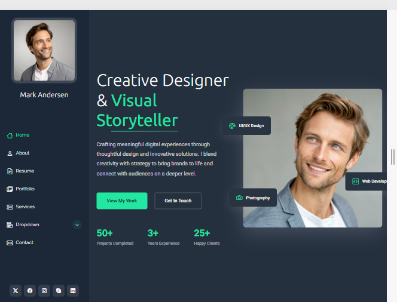

2. **Personalización de datos:** se reemplazó todo el contenido de ejemplo (nombre, descripción, redes sociales, correo y teléfono) por la información real del autor.
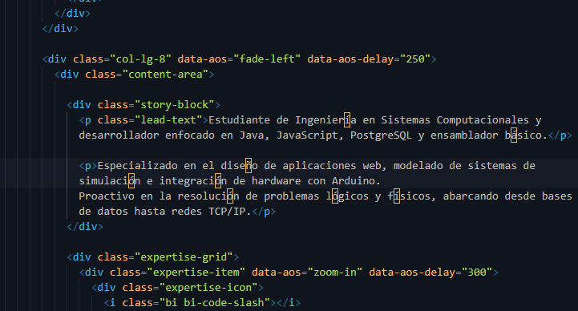

3. **Organización de carpetas de imágenes:** dentro de `assets/img/` se crearon subcarpetas específicas para mantener el proyecto ordenado: `person/` (foto de perfil), `certifications/` (constancias y certificados), `portfolio/` (capturas de los proyectos mostrados en la galería) y `screenshots/` (capturas de pantalla del sitio funcionando, usadas en este README). Separar las imágenes por su propósito evita mezclar fotos personales con capturas de proyectos o evidencias de certificaciones.
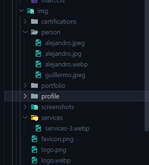


4. **Foto de perfil:** se sustituyó la imagen genérica de la plantilla por una fotografía real y profesional, guardada en `assets/img/person/guillermo.jpeg`.
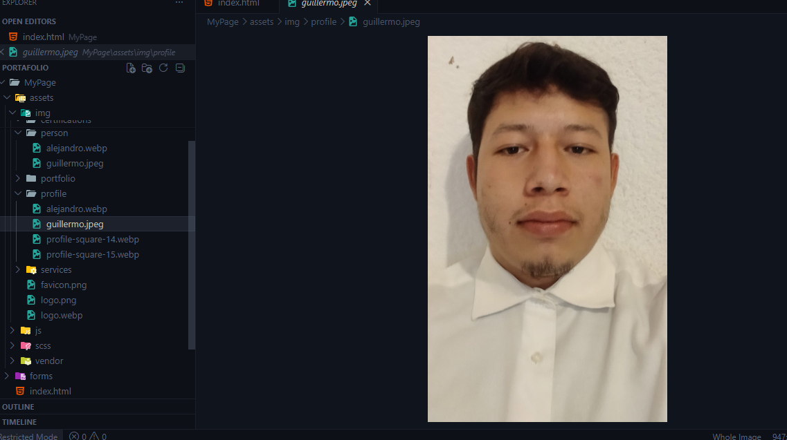

5. **Certificaciones:** se agregaron las constancias y certificados reales obtenidos (INFOTEC, Huawei ICT Academy x2, reconocimiento ITO) en la sección de Resumen, cada una enlazada a su imagen correspondiente en `assets/img/certifications/`.
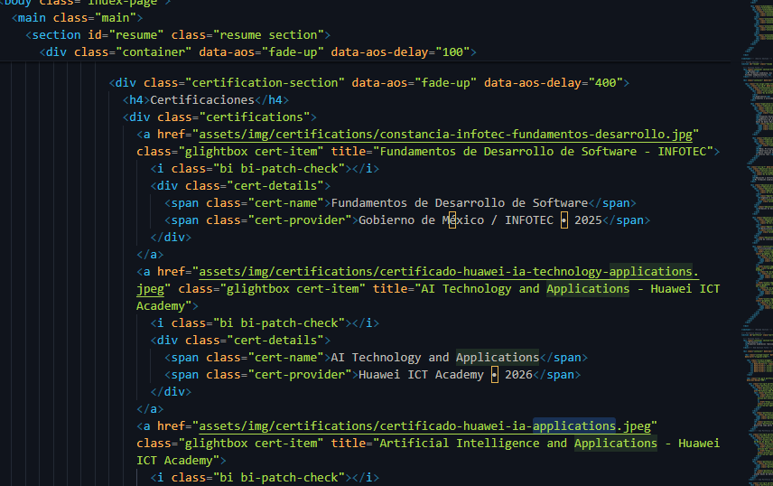
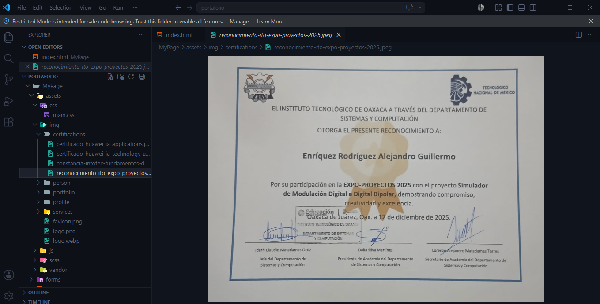


6. **Proyectos del portafolio:** se reemplazaron los proyectos de ejemplo por proyectos académicos reales (portafolio web, sistema SQL/NoSQL, aplicación en Java, ejercicio en ensamblador, simulador de modulación con Arduino, juego de trivia "Pregunta y Confundido" y sistema de ventas en Java/NetBeans), cada uno con su captura en `assets/img/portfolio/`.

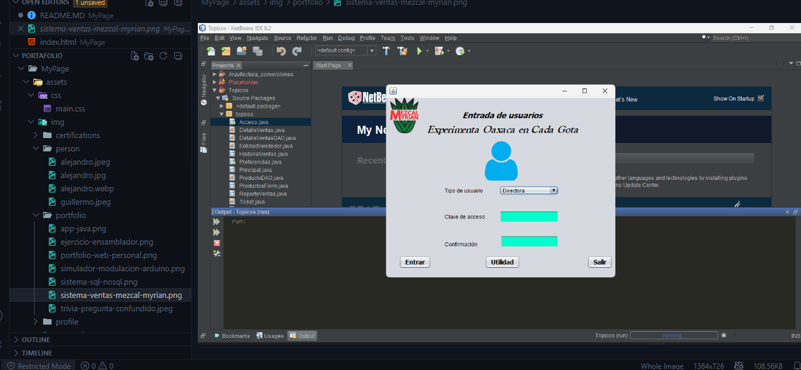

7. **Ajustes de estilo:** se corrigió el comportamiento del scroll del menú lateral (`#header`) para ocultar la barra de desplazamiento visual sin perder la función de scroll, agregando reglas `scrollbar-width: none` y `::-webkit-scrollbar { display: none; }` en `assets/css/main.css`.
8. **Revisión final:** se verificó que todas las rutas de imágenes (perfil, certificaciones y portafolio) coincidieran exactamente con los archivos guardados en el proyecto, y se tomaron capturas de pantalla de cada sección del sitio ya funcionando para documentar el resultado en este README.

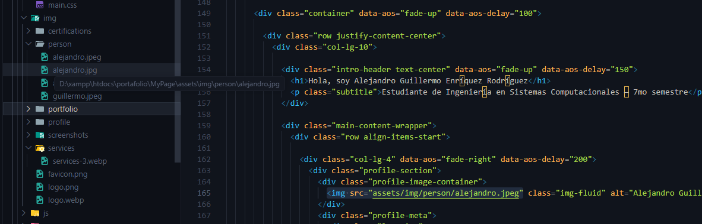

---

## Capturas de pantalla

### Sección Inicio
Vista principal del sitio: presentación, foto de perfil y estadísticas rápidas.
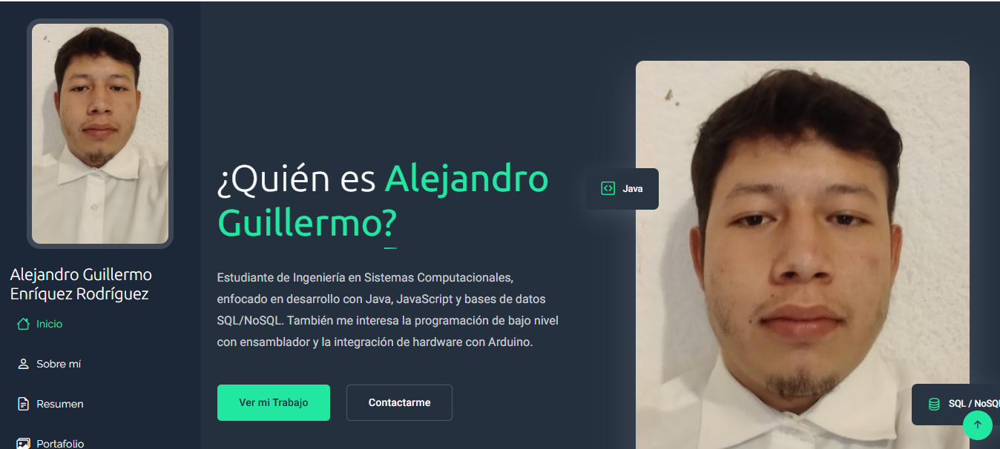

### Sección Sobre mí
Descripción personal y áreas de especialidad.
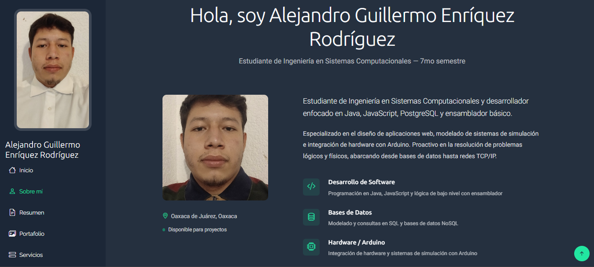

### Sección Habilidades
Barras de progreso por tecnología y resumen de certificaciones en el panel lateral.
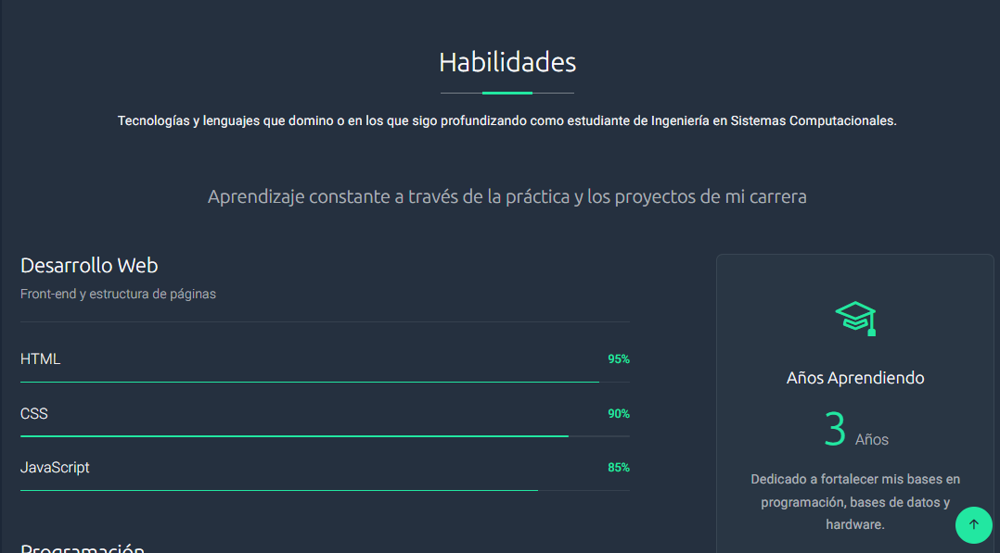
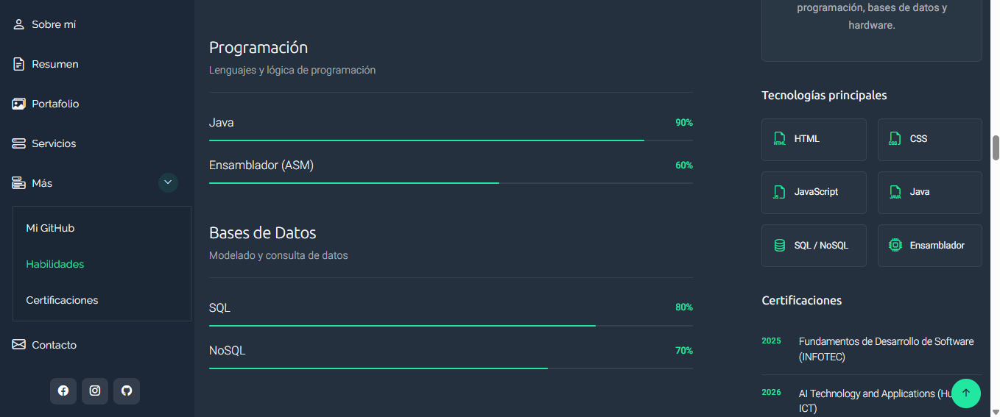

### Sección Resumen (Educación y Certificaciones)
Línea de tiempo de experiencia, educación y certificaciones con enlace a cada constancia/certificado.
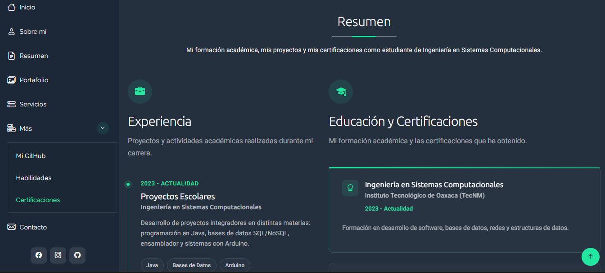
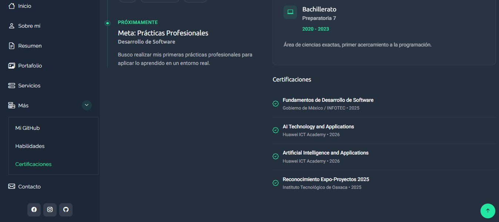

### Sección Portafolio
Galería de proyectos académicos con filtros por categoría (Desarrollo Web, Bases de Datos, Java/ASM, Arduino).
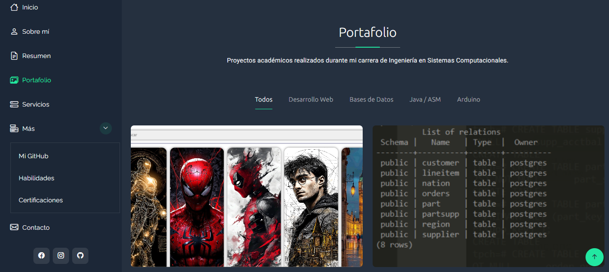
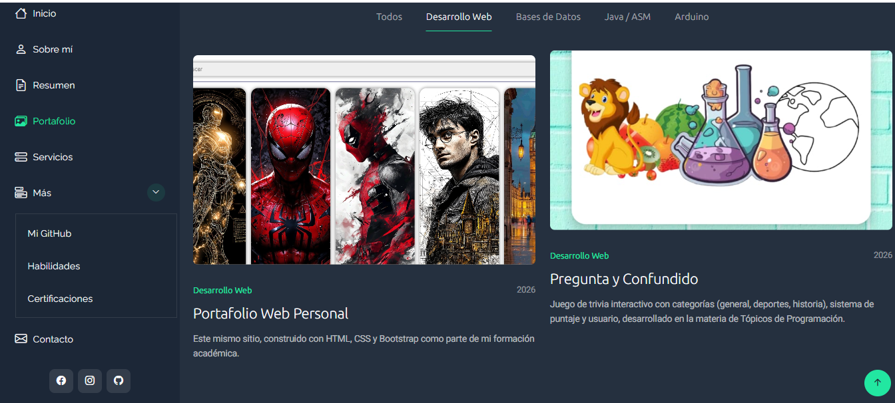
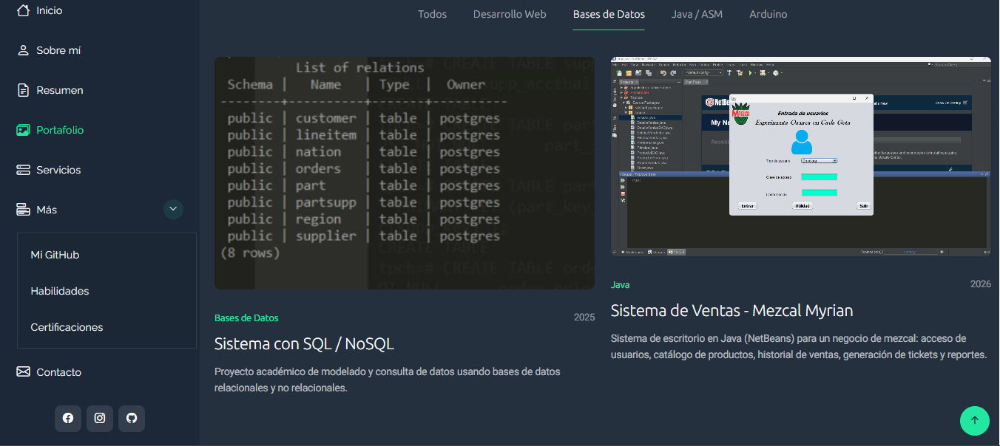
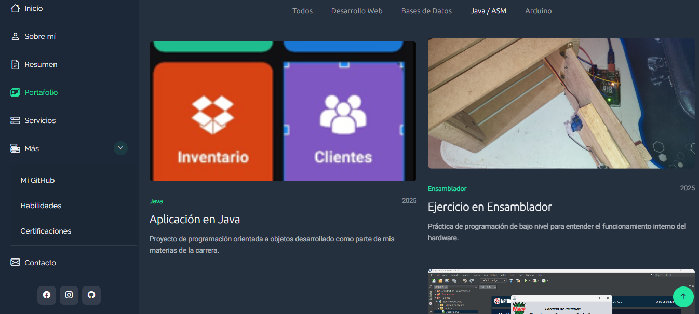
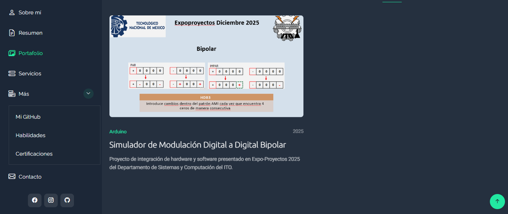

### Sección Contacto
Datos de contacto y formulario de mensaje.
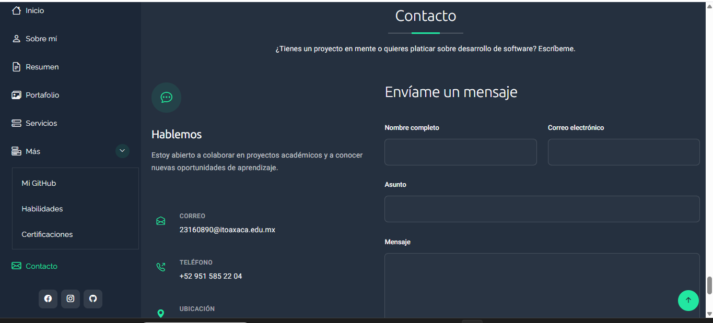
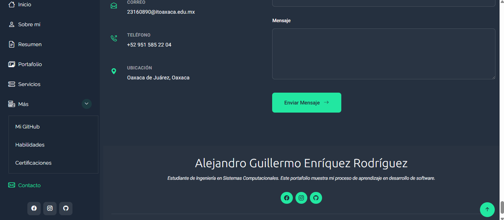

---

## Tecnologías utilizadas

- **HTML5** — estructura del sitio
- **CSS3 / Bootstrap 5.3.8** — estilos y sistema de rejilla (grid)
- **JavaScript** — AOS (animaciones al hacer scroll), GLightbox (galería de imágenes), Isotope (filtros del portafolio), sin frameworks como React o Vue

---

## Ver en vivo

🔗 **GitHub Pages:** https://alejandroguillermo7.github.io/PORTAFOLIO/
🔗 **Repositorio:** https://github.com/AlejandroGuillermo7/PORTAFOLIO-AGER

---

## Autor

**Enríquez Rodríguez Alejandro Guillermo**
Estudiante de Ingeniería en Sistemas Computacionales — Instituto Tecnológico de Oaxaca